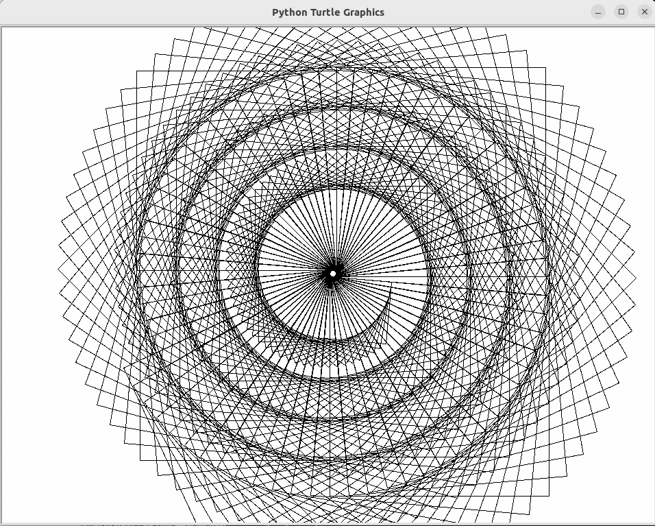

# Graphics Programming 

This repository contains a collection of different programs showcasing some interesting graphic programming examples. 
1. Purple Rain

2. Sierpinski's Triangle

3. Turtle Programming 

